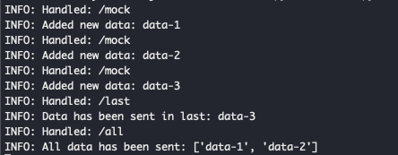

# Webmocket
Fake websocket server for websocket integration tests.

## Installation on Pypi
```bash
pip install webmocket
```

## Installation on Docker Hub
```bash
docker run --rm -p 8765:8765 --name webmocket dinohunt3r/webmocket
```

## Run
```bash
python -m webmocket.server
python -m webmocket.server -b 0.0.0.0 -p 8765
```

## Examples
See [examples/](examples) for simple usage and docker.

## Screenshot

